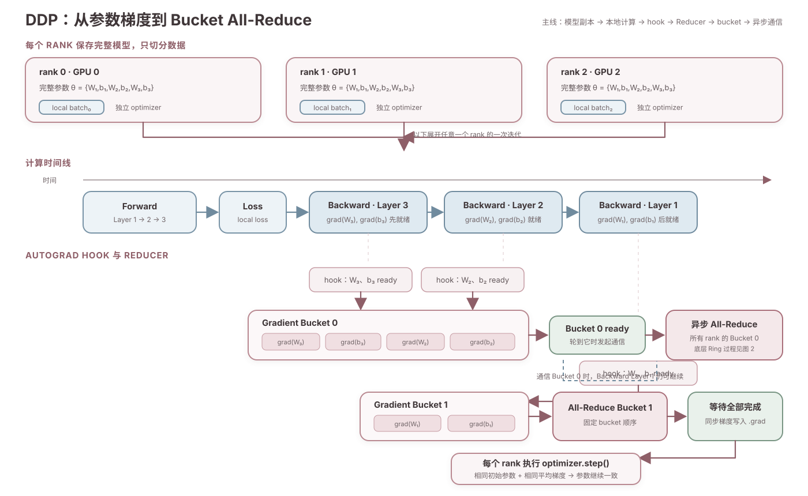
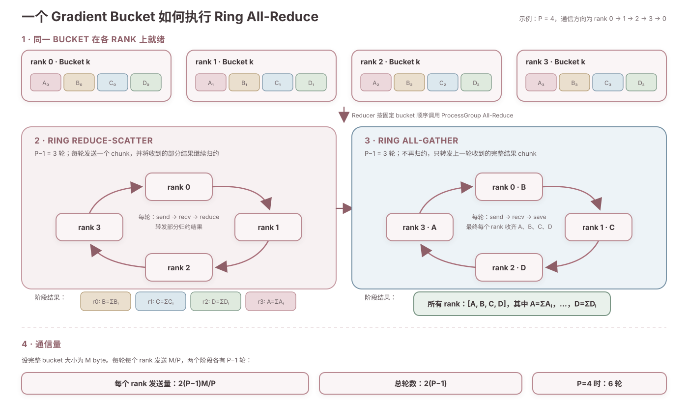

# DataParallel 与 DistributedDataParallel

## DataParallel

DataParallel 的核心思想是：每张 GPU 保存一份完整模型，训练数据按 batch 维度切分到不同 GPU。

```text
                    Global Batch
                           │
                按 batch 维度切分
            ┌──────────────┼──────────────┐
            ▼              ▼              ▼
         GPU 0          GPU 1          GPU 2          GPU 3
         batch₀         batch₁         batch₂         batch₃
         完整模型 θ      完整模型 θ      完整模型 θ      完整模型 θ
            │              │              │              │
         Forward         Forward         Forward         Forward
            │              │              │              │
         loss₀           loss₁           loss₂           loss₃
            │              │              │              │
         Backward        Backward        Backward        Backward
            │              │              │              │
         梯度 g₀          梯度 g₁          梯度 g₂          梯度 g₃
            └──────────────┴──────────────┴──────────────┘
                           │
                       梯度同步
                           │
                g = (g₀+g₁+g₂+g₃) / 4
                           │
                    Optimizer Step
                           │
                所有模型参数保持一致
```

上图表示通用的同步数据并行思想。PyTorch 中的 `torch.nn.DataParallel` 是一种单进程、多线程实现，GPU 0 通常会承担更多工作：

- GPU 0 将输入 scatter 到其他 GPU。
- 各 GPU 使用模型副本完成 Forward 和 Backward。
- 输出 gather 到 GPU 0。
- 梯度 reduce 到 GPU 0 上的主模型。

因此 `DataParallel` 容易在 GPU 0 上形成计算、显存和通信瓶颈。

## DistributedDataParallel

`DistributedDataParallel` 采用多进程，通常每个进程独占一张 GPU，因此不受单个 Python 进程 GIL 的限制。每个 rank 持有完整模型，但处理不同的 local batch。

DDP 会为每个模型副本创建一个 `Reducer`：

> `Reducer` 为每个参数注册 autograd hook，并把多个参数的梯度组织成 gradient bucket。Backward 时，某个参数的梯度就绪会触发 hook。当一个 bucket 中的所有梯度都就绪，并且轮到该 bucket 通信时，`Reducer` 异步发起该 bucket 的 All-Reduce，使其通信与后续 Backward 计算重叠。



这个过程中有几个关键点：

- Bucket 中组织的是参数梯度，不是参数本身。
- 实际跟踪梯度就绪状态的是 `Reducer` 注册的 autograd hook。
- 靠近模型输出端的参数梯度通常先就绪，但实际顺序由 autograd 计算图决定。
- 只有 bucket 内的所有梯度都就绪后，该 bucket 才会被标记为 ready。
- 所有 rank 必须以相同顺序参与 collective，因此 DDP 按固定的 bucket index 顺序发起 All-Reduce。
- `optimizer.step()` 需要等待所有 bucket 的梯度同步完成。

### Bucket 与 Ring All-Reduce

DDP 调用的是 All-Reduce 通信语义。通信后端可以选择 Ring、Tree 或其他算法实现它。下图展示一个已就绪的 gradient bucket 使用 Ring All-Reduce 时的过程。



Ring All-Reduce 由两个阶段组成：

```text
Ring Reduce-Scatter
        +
Ring All-Gather
        =
Ring All-Reduce
```

Reduce-Scatter 阶段完成全局梯度归约，使每个 rank 保留一个完成归约的 chunk；All-Gather 阶段交换这些 chunk，使每个 rank 都得到完整的同步梯度。

### DDP 通信量

假设 DDP 需要同步的梯度总大小为 $G$ byte，数据并行组中有 $P$ 个 rank，且通信后端对每个 gradient bucket 使用 Ring All-Reduce。

对大小为 $M$ byte 的一个 bucket，Ring Reduce-Scatter 和 Ring All-Gather 都需要 $P-1$ 轮，每轮每个 rank 发送 $M/P$ byte。因此，每个 rank 的发送量为：

$$
V_{\text{bucket, per-rank}}
=2(P-1)\frac{M}{P}
=2\frac{P-1}{P}M
$$

整个系统针对这个 bucket 的累计发送量为：

$$
V_{\text{bucket, total}}=2(P-1)M
$$

假设梯度被划分成 $K$ 个 bucket，第 $k$ 个 bucket 的大小为 $M_k$，则：

$$
\sum_{k=1}^{K}M_k=G
$$

每个 rank 在一次 Backward 中的梯度发送量为：

$$
\begin{aligned}
V_{\text{DDP, per-rank}}
&=\sum_{k=1}^{K}2\frac{P-1}{P}M_k \\
&=2\frac{P-1}{P}G
\end{aligned}
$$

整个数据并行组的累计发送量为：

$$
V_{\text{DDP, total}}=2(P-1)G
$$

当 $P$ 很大时，每个 rank 的发送量趋近 $2G$。因此，将梯度拆成 bucket 并不会减少 Ring All-Reduce 的主体数据量，它的主要作用是：

- 避免为每个参数单独发起小消息 All-Reduce。
- 提高大消息的带宽利用率。
- 在部分梯度就绪后尽早开始通信。
- 将前面 bucket 的通信与后续梯度的 Backward 计算重叠。

Bucket 大小存在权衡：

| Bucket 大小 | 优点 | 缺点 |
| --- | --- | --- |
| 较小 | 更早就绪，有更多通信计算重叠机会 | All-Reduce 次数增加，固定启动延迟增加 |
| 较大 | All-Reduce 次数减少，带宽利用率通常更高 | 等待更多梯度就绪，通信启动更晚 |

设每轮通信的固定启动延迟为 $\alpha$，环上有效带宽为 $B$。如果暂时忽略通信与计算重叠，$K$ 个 bucket 的 Ring All-Reduce 通信时间可以近似写成：

$$
T_{\text{DDP, comm}}
\approx 2K(P-1)\alpha
+2\frac{P-1}{P}\frac{G}{B}
$$

第一项是 $K$ 个 bucket 带来的启动延迟，第二项是传输梯度数据的带宽时间。实际迭代中，部分 All-Reduce 会被 Backward 计算隐藏，因此这个式子不能直接当作迭代时间。

最后，Bucket 属于 DDP 的梯度组织和通信调度机制；Ring 属于通信后端对 All-Reduce 的一种实现。DDP 只请求 All-Reduce 语义，并不保证后端一定选择 Ring。

## 使用 PyTorch 编写 DDP

下面将一个最小 DDP 训练程序拆成多个部分。这些代码按顺序组合后，可以保存为 `train_ddp.py`。

### 导入依赖并定义模型

每个 DDP 进程都会创建一份完整的 `ToyModel`。

```python
import os

import torch
import torch.distributed as dist
import torch.nn as nn
from torch.nn.parallel import DistributedDataParallel as DDP
from torch.utils.data import DataLoader, TensorDataset
from torch.utils.data.distributed import DistributedSampler


class ToyModel(nn.Module):
    def __init__(self):
        super().__init__()
        self.layers = nn.Sequential(
            nn.Linear(16, 32),
            nn.ReLU(),
            nn.Linear(32, 4),
        )

    def forward(self, inputs):
        return self.layers(inputs)
```

### 初始化分布式环境

`torchrun` 会为每个进程设置 `RANK`、`LOCAL_RANK`和 `WORLD_SIZE` 等环境变量。`LOCAL_RANK` 用来绑定当前进程与本机 GPU，`init_process_group` 则初始化默认进程组。

```python
def setup():
    local_rank = int(os.environ["LOCAL_RANK"])
    torch.cuda.set_device(local_rank)
    dist.init_process_group(backend="nccl")

    rank = dist.get_rank()
    world_size = dist.get_world_size()
    device = torch.device("cuda", local_rank)
    return rank, local_rank, world_size, device
```

这里不需要在代码中手动设置 `MASTER_ADDR`和 `MASTER_PORT`，后面使用的 `torchrun --standalone` 会负责单机任务的 rendezvous。

### 为每个 rank 切分数据

DDP 只同步模型梯度，不会自动切分输入数据。`DistributedSampler` 使每个 rank 只处理数据集的一个分片。

```python
def build_dataloader(rank, world_size):
    generator = torch.Generator().manual_seed(0)
    features = torch.randn(1024, 16, generator=generator)
    labels = torch.randint(0, 4, (1024,), generator=generator)
    dataset = TensorDataset(features, labels)

    sampler = DistributedSampler(
        dataset,
        num_replicas=world_size,
        rank=rank,
        shuffle=True,
    )
    dataloader = DataLoader(
        dataset,
        batch_size=32,
        sampler=sampler,
        shuffle=False,
    )
    return dataloader, sampler
```

`batch_size=32` 是每个 rank 的 local batch size。在不使用梯度累积时，global batch size 为：

$$
\text{global batch size}=32\times\text{world size}
$$

### 创建 DDP 模型

先把普通 PyTorch 模型移动到当前进程绑定的 GPU，再使用 `DDP` 包装。创建 `DDP` 时，各 rank 上的模型初始状态会被同步。

```python
def build_model(local_rank, device):
    model = ToyModel().to(device)
    ddp_model = DDP(model, device_ids=[local_rank])
    optimizer = torch.optim.AdamW(ddp_model.parameters(), lr=1e-3)
    return ddp_model, optimizer
```

后续必须通过 `ddp_model(...)` 执行 Forward，不要绕过 DDP 包装器直接调用原始 `model`。

### 执行训练

每个 rank 独立执行 Forward 并计算 local loss。调用 `loss.backward()` 时，DDP 注册的 autograd hook 会随梯度就绪依次触发 bucket All-Reduce。

```python
def train(ddp_model, optimizer, dataloader, sampler, device, rank):
    criterion = nn.CrossEntropyLoss()

    for epoch in range(2):
        sampler.set_epoch(epoch)

        for features, labels in dataloader:
            features = features.to(device)
            labels = labels.to(device)

            optimizer.zero_grad(set_to_none=True)
            logits = ddp_model(features)
            loss = criterion(logits, labels)
            loss.backward()
            optimizer.step()

        if rank == 0:
            print(f"epoch={epoch}, rank0_local_loss={loss.item():.4f}")
```

`sampler.set_epoch(epoch)` 使所有 rank 在新 epoch 中使用一致但不同于上一个 epoch 的 shuffle 顺序。

`loss.backward()` 返回前，当前迭代所需的梯度 All-Reduce 已完成，因此各 rank 上对应参数的梯度一致。各进程再独立执行相同的 `optimizer.step()`，模型参数会继续保持一致。

### 组合各部分

`main` 函数负责按顺序初始化进程组、数据和模型，训练结束后销毁进程组。

```python
def main():
    rank, local_rank, world_size, device = setup()

    try:
        dataloader, sampler = build_dataloader(rank, world_size)
        ddp_model, optimizer = build_model(local_rank, device)
        train(
            ddp_model,
            optimizer,
            dataloader,
            sampler,
            device,
            rank,
        )
    finally:
        dist.destroy_process_group()


if __name__ == "__main__":
    main()
```

### 启动单机多卡训练

使用 4 张 GPU 时，由 `torchrun` 创建 4 个进程：

```bash
torchrun --standalone --nproc-per-node=4 train_ddp.py
```

每个进程都执行同一份 `train_ddp.py`，但具有不同的 `RANK` 和 `LOCAL_RANK`，因此会绑定不同 GPU，并通过 `DistributedSampler` 读取不同数据分片。
