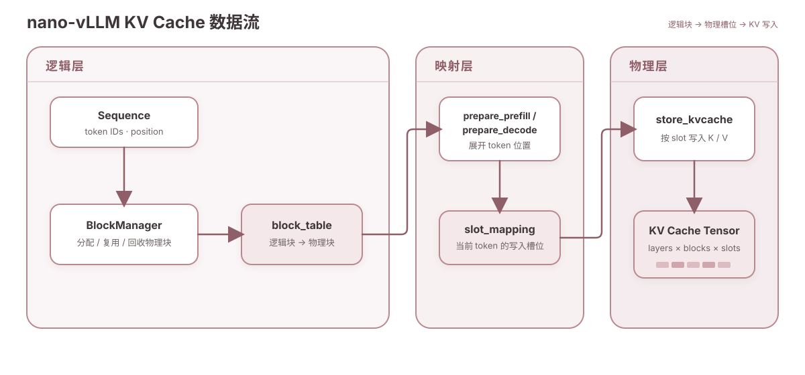

# nano-vLLM：KV Cache 与 Paged Attention

## KV Cache 与 Paged Attention 解决的问题

自回归生成会在每一步重复使用历史 token 的 Key 和 Value。若每条序列各自保存一段连续显存，长度变化、提前结束和并发调度很容易造成预留浪费与碎片。Paged Attention 的核心思路是把 KV Cache 切成固定大小的物理块，让一条逻辑连续的序列可以分散存放，再通过块表恢复顺序。

在 nano-vLLM 中，这条链路可以拆成三个问题：

1. `BlockManager` 如何为序列分配、复用和回收物理块？
2. `block_table` 如何变成本轮 token 的物理写入地址 `slot_mapping`？
3. 新生成的 K/V 最终如何落到全局 KV Cache Tensor？

## 三层数据流



图中从左到右是逻辑块、地址映射和物理写入。图片只负责建立整体关系；下面各节给出可以复算的规则。

| 层级 | 核心对象 | 输入 | 输出 |
| --- | --- | --- | --- |
| 逻辑层 | `Sequence`、`BlockManager` | token 序列与缓存状态 | `block_table` |
| 映射层 | `prepare_prefill`、`prepare_decode` | `block_table` 与 token position | `slot_mapping` |
| 物理层 | `store_kvcache` | 新计算的 K/V 与 `slot_mapping` | 写入全局 KV Cache Tensor |

这里需要区分两种地址：`block_table` 记录一条序列的“逻辑块 → 物理块”关系；`slot_mapping` 则进一步定位到物理块内的具体 token 槽位。

## 全局 KV Cache 张量

nano-vLLM 在模型执行器中一次性申请全局缓存，形状可以抽象为：

```text
[2, num_layers, num_blocks, block_size, num_kv_heads, head_dim]
 │       │           │           │             │            └─ 每个 head 的维度
 │       │           │           │             └────────────── KV heads 数量
 │       │           │           └──────────────────────────── 每个物理块的 token 槽位数
 │       │           └──────────────────────────────────────── 物理块总数
 │       └──────────────────────────────────────────────────── 模型层数
 └──────────────────────────────────────────────────────────── K 与 V
```

`num_blocks` 是显存预算能够容纳的物理块数量，`block_size` 是每块可保存的 token 数。序列不直接拥有一段独占张量，而是持有物理块编号列表。这样，物理块可以按需分配，也可以被具有相同完整前缀的序列共享。

从写入角度看，`num_blocks × block_size` 可以理解为一维物理槽位空间。映射层先算出每个新 token 的槽位编号，`store_kvcache` 再把该 token 在每一层产生的 K/V 写入对应位置。

## BlockManager 生命周期

`BlockManager` 同时维护物理块对象、空闲块队列、使用中块集合，以及“前缀哈希 → 物理块”的索引。一个块的 `ref_count` 表示当前有多少条序列仍在引用它。

### 1. `can_allocate`：先找可复用的完整前缀

进入 prefill 前，序列只有 token IDs，还没有 `block_table`。`can_allocate` 对逻辑块做链式哈希，在缓存索引中寻找从序列开头连续匹配的块。匹配不仅比较哈希，还会核对块中的 token IDs。

扫描范围使用 `range(seq.num_blocks - 1)`：最后一个逻辑块可能尚未填满，内容还会变化，因此只有完整块可以作为稳定的前缀缓存。函数还会结合剩余空闲块判断本次分配是否可行。

### 2. `allocate`：复用前缀，再补齐新块

下面是用于表达控制流的结构化伪代码，不是可直接运行的源码：

```python
def allocate(sequence, cached_block_count):
    for logical_block in range(cached_block_count):
        block_id = find_cached_physical_block(sequence.block(logical_block))
        activate_if_free(block_id)
        blocks[block_id].ref_count += 1
        sequence.block_table.append(block_id)

    for logical_block in range(cached_block_count, sequence.num_blocks):
        sequence.block_table.append(allocate_free_block())

    sequence.num_cached_tokens = cached_block_count * block_size
```

已在使用的缓存块只增加 `ref_count`；仍保留缓存内容但位于空闲队列中的块会被重新激活；不能复用的逻辑块则领取新的物理块。

### 3. `may_append`：decode 跨块时扩容

decode 每次追加一个 token。若追加后满足下面的边界条件，说明新 token 是一个新逻辑块的第一个元素，需要再分配一个物理块：

```python
needs_new_block = len(sequence) % block_size == 1
```

因此，`may_append` 不是每生成一个 token 都分配块，而是在跨越块边界时分配。

### 4. `hash_blocks`：登记新完成的块

当块已经完整且尚未建立哈希时，`hash_blocks` 计算链式前缀哈希，并把它登记到缓存索引。未填满的尾块不会提前成为可复用前缀。

### 5. `deallocate`：引用归零后惰性回收

序列结束时，`deallocate` 依次减少其物理块的 `ref_count`。只有计数降到零，块才会从使用中集合移回空闲队列。回收不会立即清空显存内容，因此同一完整前缀可能在块被覆盖前再次命中。

“内容暂留”不等于“哈希映射永久有效”。空闲块被重新分配给其他内容时，如果旧哈希仍指向这个物理块，分配逻辑会删除旧映射，避免把已经覆盖的块误认为缓存命中。

## 从 `block_table` 到 `slot_mapping`

设 token 在序列中的位置为 `position`，转换分四步：

```text
logical_block = position // block_size
offset        = position % block_size
block_id      = block_table[logical_block]
slot          = block_id * block_size + offset
```

也就是：

```text
slot = block_id * block_size + offset
```

prefill 会为本轮需要计算的多个 token 生成一组 slot；decode 通常只为每条活动序列的最新 token 生成 slot。两条路径最终都把“序列中的位置”翻译成“全局缓存中的物理写入槽位”。

`slot_mapping` 描述的是本轮新 K/V 的写入地址。Attention 读取历史 K/V 时，仍需结合块表与上下文长度等元数据遍历这条序列已有的物理块；它不是仅凭本轮 `slot_mapping` 读取全部历史。

## 完整映射示例

假设一条序列有 6 个 token，参数如下：

```text
block_size = 4
token positions = [0, 1, 2, 3, 4, 5]
block_table = [7, 2]
```

逻辑块 0 被放在物理块 7，逻辑块 1 被放在物理块 2。逐个代入映射公式：

| position | logical_block | offset | block_id | slot |
| ---: | ---: | ---: | ---: | ---: |
| 0 | 0 | 0 | 7 | 28 |
| 1 | 0 | 1 | 7 | 29 |
| 2 | 0 | 2 | 7 | 30 |
| 3 | 0 | 3 | 7 | 31 |
| 4 | 1 | 0 | 2 | 8 |
| 5 | 1 | 1 | 2 | 9 |

最终得到：

```text
slots = [28, 29, 30, 31, 8, 9]
```

可以看到，token 的逻辑位置连续，但对应的物理槽位不必连续。这正是分页式 KV Cache 能降低连续显存要求的原因。

## 关键结论与常见误区

- **逻辑连续不等于物理连续。** `block_table` 负责把顺序语义与物理布局解耦。
- **只有完整块适合作为稳定前缀缓存。** 未填满的尾块还会变化，不参与 `can_allocate` 的连续前缀匹配。
- **共享必须配合引用计数。** `ref_count` 未归零时，任何引用该块的序列都仍然需要它。
- **惰性回收不是永久缓存。** 数据可以暂留，但块被复用时旧哈希索引必须失效。
- **decode 不会每步都申请物理块。** 只有新 token 跨入下一个逻辑块时，`may_append` 才需要扩容。
- **`slot_mapping` 主要服务于写入。** 历史 K/V 的读取仍依赖块表和上下文元数据。

## 参考资料

- [nano-vLLM：BlockManager 实现](https://github.com/GeeeekExplorer/nano-vllm/blob/main/nanovllm/engine/block_manager.py)
- [nano-vLLM：ModelRunner 实现](https://github.com/GeeeekExplorer/nano-vllm/blob/main/nanovllm/engine/model_runner.py)
- [Kwon 等：Efficient Memory Management for Large Language Model Serving with PagedAttention](https://arxiv.org/abs/2309.06180)
