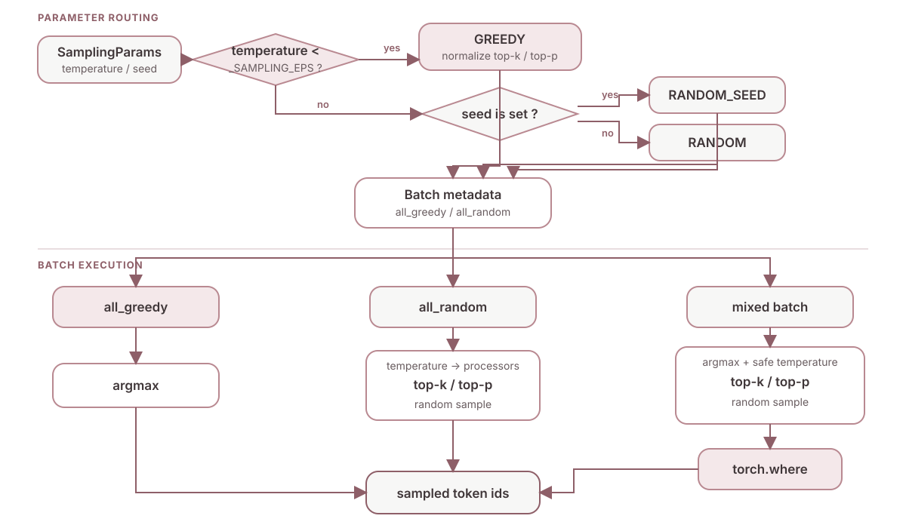

# vLLM Sampling

## Sampling 解决的问题

模型前向计算只产生一行 `logits`，采样器必须把它变成下一个 `token_id`。同一个 batch 又可能同时包含确定性的 Greedy 请求和随机采样请求，因此 vLLM 需要同时解决两件事：

- 按请求参数选择 `GREEDY`、`RANDOM_SEED` 或 `RANDOM`。
- 在不拆分 batch 的前提下，让纯 Greedy、纯 Random 和混合 batch 都走高效路径。

本文以 vLLM V1 的 `SamplingParams`、`SamplingMetadata` 与 `Sampler` 为主线。源码会持续演进，函数位置可能变化，但参数归一化和 batch 分流这两个核心思路保持一致。

## Greedy Sampling 判定

`SamplingParams.sampling_type` 用 `temperature` 与 `_SAMPLING_EPS` 判断采样类型：

```python
@cached_property
def sampling_type(self) -> SamplingType:
    if self.temperature < _SAMPLING_EPS:
        return SamplingType.GREEDY
    if self.seed is not None:
        return SamplingType.RANDOM_SEED
    return SamplingType.RANDOM
```

当前源码中的两个阈值分别是：

```python
_SAMPLING_EPS = 1e-5
_MAX_TEMP = 1e-2
```

由此可以得到三个温度区间：

1. `temperature < 1e-5`：判定为 `SamplingType.GREEDY`。
2. `1e-5 <= temperature < 1e-2`：仍属于随机采样，但会被抬高到 `_MAX_TEMP`，避免过小温度引起数值问题。
3. `temperature >= 1e-2`：使用用户给定温度进行随机采样。

Greedy 的判断不用严格的 `temperature == 0`，是为了给浮点输入留出稳定边界。进入 Greedy 分支后，`SamplingParams.__post_init__` 还会关闭只对随机截断有意义的参数：

```python
if self.temperature < _SAMPLING_EPS:
    self.top_p = 1.0
    self.top_k = 0
    self.min_p = 0.0
    self._verify_greedy_sampling()
```

这里 `top_p = 1.0`、`top_k = 0` 和 `min_p = 0.0` 都表示不截断候选 token；`_verify_greedy_sampling()` 则要求 Greedy 请求的 `n` 必须为 `1`。

## Greedy Sampling 流程

下面的流程图把参数判定与 batch 内的实际执行路径连在一起。图中的三条 batch 路径并不是三套独立调度器，而是 `Sampler.sample()` 根据 `all_greedy` 和 `all_random` 选择的快路径。



## Batch 聚合

请求加入 batch 时，元数据层会记录每个请求的采样类型。Greedy 请求的温度槽位保持为 `0.0`，随机请求则保存真实温度：

```python
if sampling_params.sampling_type == SamplingType.GREEDY:
    self.temperature_cpu[req_index] = 0.0
    self.greedy_reqs.add(req_id)
else:
    self.temperature_cpu[req_index] = sampling_params.temperature
    self.random_reqs.add(req_id)
```

随后可以从集合状态派生 `all_greedy` 与 `all_random`，避免逐行启动不同 kernel。

### All Greedy

当 `all_greedy` 为真时，不需要把 temperature tensor 复制到 GPU。采样器直接计算 `argmax` 并提前返回：

```python
greedy_sampled = self.greedy_sample(logits)
if sampling_metadata.all_greedy:
    return greedy_sampled, processed_logprobs
```

这条路径不做温度缩放，不构造随机概率分布，也不调用随机数生成器。

### All Random

当 `all_random` 为真时，采样器跳过预先计算的 Greedy `argmax`，依次执行温度缩放、argmax-invariant processors、`top-k / top-p` 截断和随机采样。

### 混合 Batch

混合 batch 需要同时保留两种结果。采样器先对整批 `logits` 计算 `greedy_sampled`，再生成 `random_sampled`。为避免 Greedy 行执行除零，`apply_temperature()` 用 `torch.where` 临时把这些行的温度替换为 `1.0`：

```python
@staticmethod
def apply_temperature(logits, temp, all_random):
    if not all_random:
        temp = torch.where(temp < _SAMPLING_EPS, 1.0, temp)
    return logits.div_(temp.unsqueeze(dim=1))
```

最后再次用请求级 temperature mask 合并两条路径：

```python
sampled = torch.where(
    sampling_metadata.temperature < _SAMPLING_EPS,
    greedy_sampled,
    random_sampled,
    out=greedy_sampled,
)
```

因此，Greedy 行虽然参与了随机路径的批量 tensor 运算，最终结果仍取自预先计算的 `argmax`。

## Logits 处理顺序

`Sampler` 并非拿到原始 `logits` 就立即采样。以当前 V1 实现为例，主要顺序是：

1. 应用可能改变 `argmax` 的约束和 processors，例如 allowed-token mask、bad words、最小生成长度与 logit bias。
2. 应用 repetition、frequency 和 presence penalties。
3. 若 batch 含 Greedy 请求，先计算 `argmax`。
4. 对随机路径应用 `temperature`。
5. 应用不改变 `argmax` 的 processors，例如默认的 `min_p` processor。
6. 应用 `top-k / top-p` 并随机采样。
7. 混合 batch 用 `torch.where` 选回每一行对应的结果。

“argmax-invariant”表示 processor 不会改变分数最高 token 的身份，所以它可以放在 Greedy 结果计算之后；反之，可能改变最高分 token 的 processor 必须先执行。

## Top-k 与 Top-p

`top-k` 保留分数最高的 `k` 个 token，其余位置写入负无穷：

```python
top_k_mask = logits_sort.size(1) - k.to(torch.long)
top_k_threshold = logits_sort.gather(1, top_k_mask.unsqueeze(dim=1))
logits_sort.masked_fill_(logits_sort < top_k_threshold, -float("inf"))
```

`top-p` 按概率质量保留最小候选集合。vLLM 的实现可以在升序排列上屏蔽累计概率位于 `1 - p` 之前的低概率 token，并强制至少保留一个候选：

```python
probs_sort = logits_sort.softmax(dim=-1)
probs_sum = torch.cumsum(probs_sort, dim=-1, out=probs_sort)
top_p_mask = probs_sum <= 1 - p.unsqueeze(dim=1)
top_p_mask[:, -1] = False
logits_sort.masked_fill_(top_p_mask, -float("inf"))
```

处理完毕后，`scatter_()` 按 `logits_idx` 把排序后的分数写回原 token 顺序。

## 关键结论

- `temperature < _SAMPLING_EPS` 才是源码层面的 Greedy 判定条件。
- Greedy 参数会被归一化，`top_k`、`top_p` 和 `min_p` 不再影响候选集合。
- `all_greedy` 直接 `argmax` 并提前返回；`all_random` 不计算 Greedy 结果。
- 混合 batch 通过安全温度和 `torch.where` 共用向量化计算，同时保证每行采用正确策略。
- processor 的相对顺序取决于它是否可能改变 `argmax`。

## 参考资料

- [vLLM SamplingParams 源码](https://github.com/vllm-project/vllm/blob/main/vllm/sampling_params.py)
- [vLLM V1 Sampler API 与源码](https://docs.vllm.ai/en/latest/api/vllm/v1/sample/sampler/)
